# root-page

<!-- Auto Generated Below -->

## Dependencies

### Depends on

- [home-page](../home-page)
- [admin-login](../admin-section/admin-login)
- [user-login](../user-section/user-login)
- [admin-registration](../admin-section/admin-registration)
- [user-registration](../user-section/user-registration)
- [user-homepage](../user-section/user-homepage)
- [admin-homepage](../admin-section/admin-homepage)
- [add-books](../admin-section/add-books)
- [book-search](../admin-section/book-search)
- [all-books](../admin-section/all-books)
- [user-book-search](../user-section/user-book-search)
- [place-order](../user-section/place-order)
- [view-date-info](../user-section/view-date-info)
- [book-return](../user-section/return-book)
- [view-orders](../admin-section/view-orders)
- [return-request](../return-request)

### Graph

```mermaid
graph TD;
  root-page --> home-page
  root-page --> admin-login
  root-page --> user-login
  root-page --> admin-registration
  root-page --> user-registration
  root-page --> user-homepage
  root-page --> admin-homepage
  root-page --> add-books
  root-page --> book-search
  root-page --> all-books
  root-page --> user-book-search
  root-page --> place-order
  root-page --> view-date-info
  root-page --> book-return
  root-page --> view-orders
  root-page --> return-request
  style root-page fill:#f9f,stroke:#333,stroke-width:4px
```

----------------------------------------------

*Built with [StencilJS](https://stenciljs.com/)*
